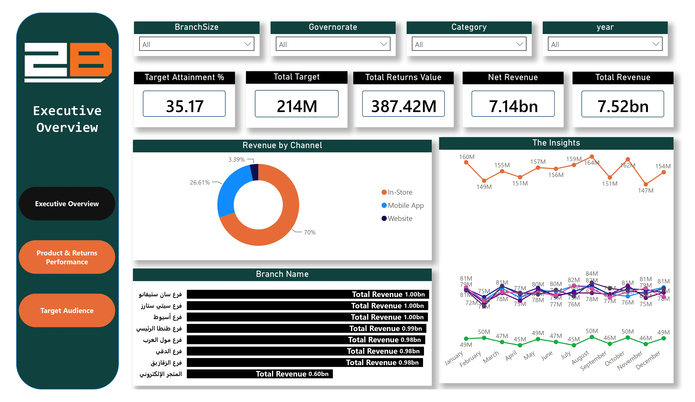
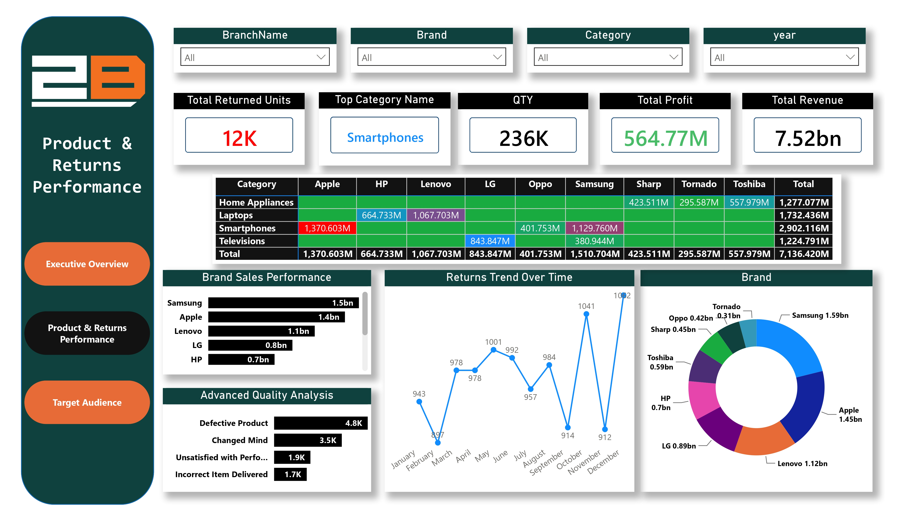
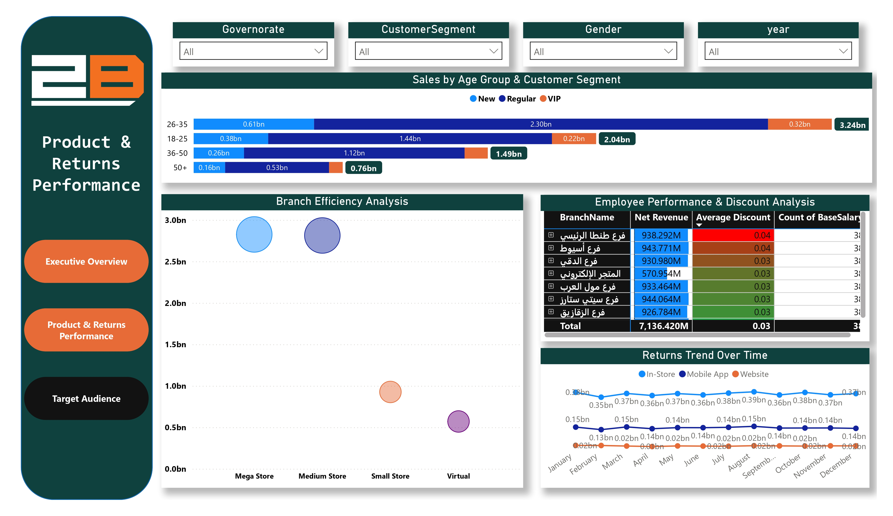

# 🛒 2B Egypt Retail & Returns Analytics (Enterprise BI Project)

## 📌 Project Overview
This is an end-to-end Enterprise Business Intelligence project analyzing sales, financial targets, and return operations for **2B Egypt**, a market-leading electronics retailer. The project simulates a real-world corporate pipeline, handling a relational dataset containing **over 200,000 rows** directly connected to a database server.

The project demonstrates a complete data analytics lifecycle:
1. **SQL:** Data extraction, advanced joining, aggregation, and view creation from the live server.
2. **Microsoft Excel:** Building deep-dive analytical Pivot Tables and dynamic summaries.
3. **Power BI:** Creating a robust relational Data Model (Star Schema) and a 3-page interactive corporate dashboard.

---

## 🛠️ Data Architecture & Engineering Pipeline

### 1. Database Extraction & Cleaning (SQL Layer)
Before visualizing the data, optimized SQL scripts were executed directly on the enterprise database server to clean, transform, and aggregate raw transactional records. 

Key SQL techniques applied:
* **Complex Joins:** Combined transactional fact tables (`Sales`, `Returns`) with dimensional metadata (`Products`, `Branches`, `Customers`, `Employees`).
* **Data Cleansing:** Standardized inconsistent text fields (e.g., branch names and governorates) and handled `NULL` values in return categories using `COALESCE` and `CASE WHEN` statements.
* **Date Aggregation:** Extracted and aligned date dimensions (Year, Quarter, Month) to match corporate fiscal calendars.
* **Performance Optimization:** Created database `VIEWS` to stream structured, high-performance data directly into Excel and Power BI, reducing processing overhead.

### 2. Advanced Excel Analytical Summaries (Pivot Tables)
The cleaned SQL views were imported into Microsoft Excel to perform deep-dive exploratory data analysis (EDA) and generate tabular business reports:
* **Multi-Tab Architecture:** Structured the workbook into dedicated operational sheets: `Executive Summary`, `Product Performance`, `Returns Analysis`, and `Employee KPI`.
* **Cross-Tabulation:** Built interactive Pivot Tables incorporating conditional formatting (data bars and color scales) to instantly spotlight underperforming metrics.
* **Metric Alignment:** Verified financial metrics against the central database to ensure exact calculation consistency across reporting tools.

### 3. Data Modeling (Power BI Robust Star Schema)
In Power BI, a highly optimized **Star Schema** was structured with explicit **One-to-Many ($1 \rightarrow *)$** relationships, ensuring swift filter propagation and lightning-fast calculations:
* **Fact Tables:** `Sales` (Core transactions), `Returns` (Product returns tracking), and `Targets` (Monthly financial benchmarks).
* **Dimension Tables:** `Calendar` (Time Intelligence), `Branches` (Geographical data), `Products` (Pricing metadata), `Customers` (Demographics), and `Employees` (Staff metrics).

---

## 📐 Analytics & DAX Calculations
A centralized measure repository was built within the `Sales` table to compute critical business KPIs using advanced **DAX** formulas:

* **Total Revenue:**
  $$Total\ Revenue = SUM(Sales[Net\ Revenue])$$
* **Total Profit:**
  $$Total\ Profit = SUM(Sales[Net\ Profit])$$
* **Target Attainment %:** Evaluates how effectively branches or categories hit their monthly corporate targets:
  $$Target\ Attainment\ \% = DIVIDE([Total\ Revenue], SUM(Targets[TargetAmount\_EGP]), 0)$$
* **Total Return Value:**
  $$Total\ Return\ Value = SUM(Returns[Total\ Returns\ Value])$$

---

## 📈 Key Business Insights & Achievements
* **Financial Standing:** Successfully monitored **7.52 Billion EGP** in Total Revenue, yielding **564.77 Million EGP** in Total Profit across **236K units** sold.
* **Benchmark Performance:** The enterprise recorded a **35.17% target attainment rate** against an aggressive **214M EGP target**.
* **Omnichannel Breakdown:** Brick-and-mortar stores (`In-Store`) dominate the sales mix at **70%**, followed by the Mobile App (**26.61%**) and Website (**3.39%**).
* **Returns Deep-Dive:** Total returns accounted for **12K units** valued at **387.42 Million EGP**. **Defective Products** (4.8K units) and **Changed Mind** (3.5K units) emerged as the top return drivers, heavily concentrated within the *Smartphones* category.
* **Regional Footprint:** Top-performing branches including San Stefano, Assiut, and Dokki each successfully breached the **1.00 Billion EGP** net revenue milestone.

---

## 📊 Dashboard & Report Preview

### 1. Relational Data Model (Power BI Star Schema)


### 2. Executive Overview Dashboard (Power BI)


### 3. Product & Returns Performance Dashboard (Power BI)


### 4. Target Audience & Employee KPI Dashboard (Power BI)


### 5. Excel Deep-Dive - Executive Summary (Pivot Tables)


### 6. Excel Deep-Dive - Returns Analysis


### 7. Excel Deep-Dive - Product Performance


### 8. Excel Deep-Dive - Employee KPI


---

## 📂 Download Project Files
📥 [Click here to access and download the Power BI (.pbix) and Excel (.xlsx) source files from Google Drive](https://drive.google.com/drive/folders/1prxhjQefPDYJ6AVZOv9Knh789gUTL6Ms?usp=sharing)

---

## 📁 Repository Structure
```text
└── 2b-egypt-retail-analytics/
    └── Images/            # Data model, Dashboard, and Excel screenshots
